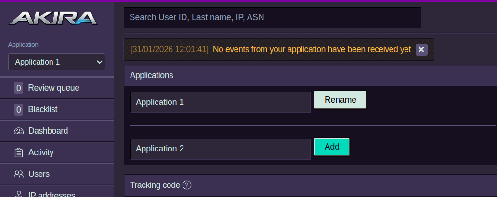
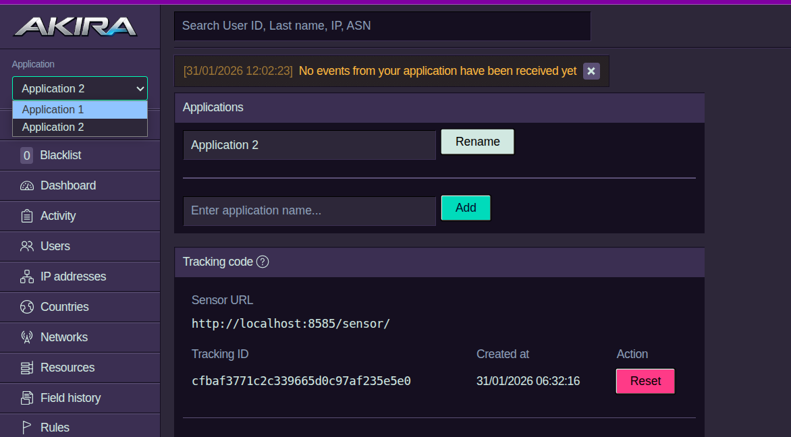

# Akira

[](https://app.codacy.com/gh/TirrenoTechnologies/tirreno/dashboard?utm_source=gh&utm_medium=referral&utm_content=&utm_campaign=Badge_grade)

<p align="center">
    <a href="https://cysecurity.org/" target="_blank">
        
    </a>
</p>

[Akira](https://cysecurity.org) is an open-source security framework, based on [Tirreno](https://github.com/TirrenoTechnologies/tirreno).

Akira helps understand, monitor, and protect your product from threats, fraud, and abuse. While classic cybersecurity focuses on infrastructure and network perimeter, most breaches occur through compromised accounts and application logic abuse that bypasses firewalls, SIEM, WAFs, and other defenses. Akira detects threats where they actually happen: inside your product.

Akira is a few-dependency, "low-tech" PHP/PostgreSQL application. After a straightforward five-minute installation, you can ingest events through API calls and immediately access a real-time threat dashboard.

## Core components
* **SDKs & API** Integrate Akira into any product with SDKs.
  Send events with full context in a few lines of code.
* **Built-in dashboard** Monitor and understand your product's
  security events from a single interface. Ready for use in minutes.
* **Single user view** Analyze behaviour patterns, risk scores,
  connected identities, and activity timelines for a specific user.
* **Rule engine** Calculate risk scores automatically with preset
  rules or create your own customized for your product.
* **Review queue** Automatically suspend accounts with risky events
  or flag them for manual review through threshold settings.
* **Field audit trail** Track modifications to important fields,
  including what changed and when to streamline audit and compliance.

## Multi-Application Support

Akira supports tracking multiple applications from a single dashboard. Each application gets its own Tracking ID (API key), and events are completely isolated between applications.

### Adding a New Application

Navigate to the **API** page to manage your applications. Enter a name and click **Add** to create a new application with its own unique Tracking ID.

<p align="center">
    
</p>

### Switching Between Applications

Use the **Application** dropdown in the sidebar to switch between applications. Each application has its own isolated data, so switching applications will redirect you to the dashboard.

<p align="center">
    
</p>

> **Note:** When integrating, ensure you use the Tracking ID (API key) that corresponds to the application you want to track. Events are routed based on the API key used, so using the wrong key will send events to the wrong application.

### Use Cases
* Monitor multiple products or applications from one Akira instance
* Isolate different client projects or business units
* Separate development, staging, and production environments

## Preset rules

`Account takeover` `Credential stuffing` `Content spam` `Account registration` `Fraud prevention` `Insider threat`
`Bot detection` `Dormant account` `Multi-accounting` `Promo abuse` `API protection` `High-risk regions`

## Built for

* **Self-hosted, internal and legacy apps**: Embed security layer
  to extend your security through audit trails, protect user accounts
  from takeover, detect cyber threats and monitor insider threats.
* **SaaS and digital platforms**: Prevent cross-tenant data leakage,
  online fraud, privilege escalation, data exfiltration and business
  logic abuse.
* **Mission critical applications**: Sensitive application protection,
  even in air-gapped deployments.
* **Industrial control systems (ICS) and command & control (C2)**: Protect,
  operational technology, command systems, and critical infrastructure
  platforms from unauthorized access and malicious commands.
* **Non-human identities (NHIs)**: Monitor service accounts, API keys,
  bot behaviors, and detect compromised machine identities.
* **API-first applications**: Protect against abuse, rate limiting
  bypasses, scraping, and unauthorized access.

## Docker Installation

```bash
git clone https://github.com/CSPF-Founder/akira-docker.git
cd akira-docker
cp .env.example .env
nano .env  # set a strong database password
docker compose up -d
```

Then visit http://localhost:8585/install to complete setup.

See [akira-docker](https://github.com/CSPF-Founder/akira-docker) for details.

## Manual Installation

### Requirements

* **PHP**: Version 8.0 to 8.3
* **PostgreSQL**: Version 12 or greater
* **PHP extensions**: `PDO_PGSQL`, `cURL`
* **HTTP web server**: `Apache` with `mod_rewrite` and `mod_headers` enabled
* **Operating system**: A Unix-like system is recommended
* **Minimum hardware requirements**:
  * **PostgreSQL**: 512 MB RAM (4 GB recommended)
  * **Application**: 128 MB RAM (1 GB recommended)
  * **Storage**: Approximately 3 GB PostgreSQL storage per 1 million events

### Steps

1. Download the latest version of Akira.
2. Extract the archive to the location where you want it installed on your web server.
3. Navigate to `http://your-domain.example/install/index.php` in a browser to launch the installation process.
4. After the successful installation, delete the `install/` directory and its contents.
5. Navigate to `http://your-domain.example/signup/` in a browser to create administrator account.
6. For cron jobs setup insert the following schedule (every 10 minutes) expression with `crontab -e` command or by editing `/var/spool/cron/your-web-server` file:

```
*/10 * * * * /usr/bin/php /absolute/path/to/akira/index.php /cron
```

## SDKs

* [PHP](https://github.com/tirrenotechnologies/tirreno-php-tracker)
* [Python](https://github.com/tirrenotechnologies/tirreno-python-tracker)
* [NodeJS](https://github.com/tirrenotechnologies/tirreno-nodejs-tracker)

## Documentation

* [Admin documentation](https://github.com/tirrenotechnologies/ADMIN.md)
* [Developer documentation](https://github.com/tirrenotechnologies/DEVELOPMENT.md)
* [User guide](https://docs.tirreno.com/)

## About

Akira is an open-source security framework that embeds protection against threats, fraud, and abuse right into your product.

Akira is based on [Tirreno](https://github.com/TirrenoTechnologies/tirreno), which started as a proprietary system in 2021 and was open-sourced (AGPL) in December 2024.

This fork is maintained by the [Cyber Security and Privacy Foundation](https://cysecurity.org).

## Links

* [Website](https://cysecurity.org)
* [GitHub Repository](https://github.com/CSPF-Founder/akira)
* [Original Tirreno Project](https://github.com/TirrenoTechnologies/tirreno)

## Reporting a security issue

If you've found a security-related issue with Akira, please report it responsibly. Submitting the issue on GitHub exposes the vulnerability to the public, making it easy to exploit.

## License

This program is free software: you can redistribute it and/or modify it under the terms of the GNU Affero General Public License (AGPL) as published by the Free Software Foundation version 3.

This program is distributed in the hope that it will be useful, but WITHOUT ANY WARRANTY; without even the implied warranty of MERCHANTABILITY or FITNESS FOR A PARTICULAR PURPOSE. See GNU Affero General Public License for more details.

You should have received a copy of the GNU Affero General Public License along with this program. If not, see [GNU Affero General Public License v3](https://www.gnu.org/licenses/agpl-3.0.txt).

## Copyright & Attribution

**Original Work:**
Copyright (C) Tirreno Technologies Sàrl (https://www.tirreno.com)
Licensed under AGPL-3.0
Source: https://github.com/TirrenoTechnologies/tirreno

**Modifications:**
Copyright (C) Cyber Security and Privacy Foundation (https://cysecurity.org)
Licensed under AGPL-3.0
